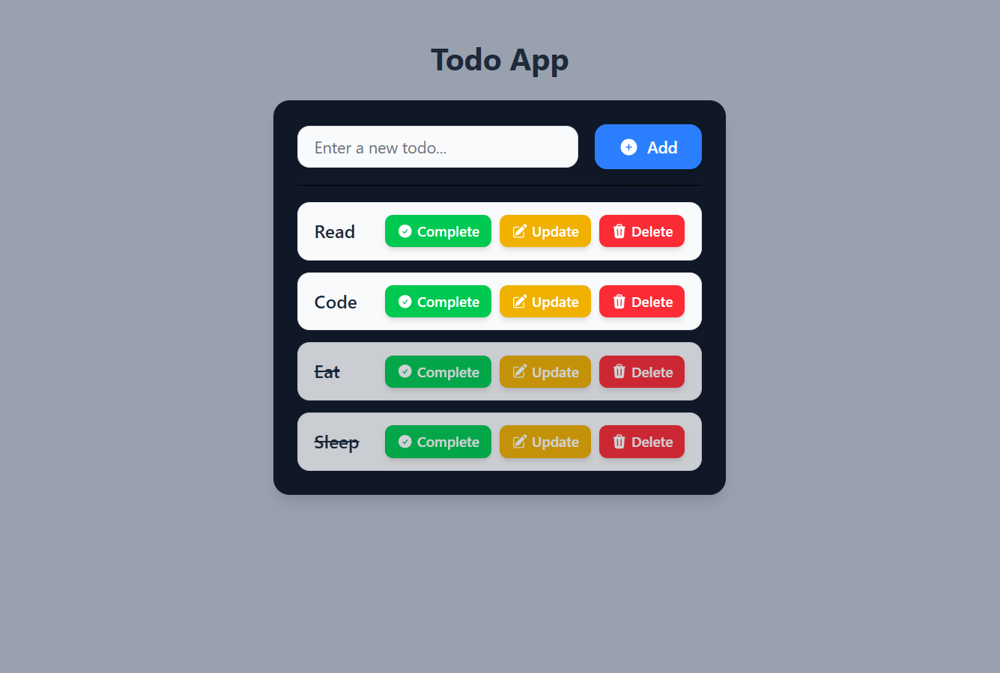

## ReactTodo App

A simple Todo application built with **React** and **Redux Toolkit** for state management.

### Features
- Add new todos
- Update existing todos
- Mark todos as completed
- Delete todos
- State management handled by Redux Toolkit

### Tech Stack
- React
- Redux Toolkit
- Tailwind CSS (for styling)

## Todo App UI

Here’s how the Todo App looks:

